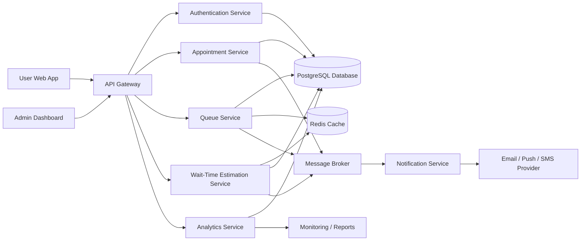
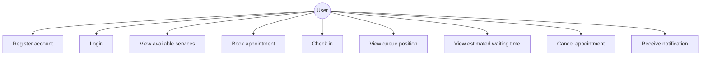
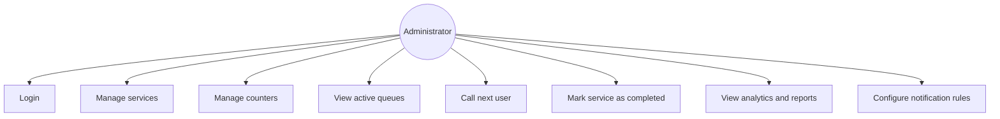
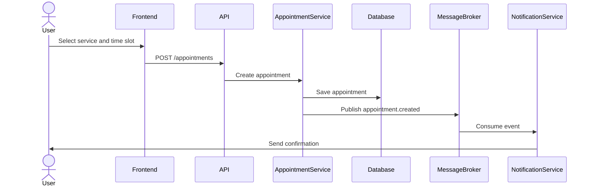
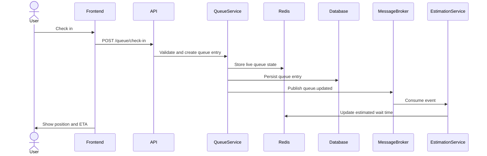
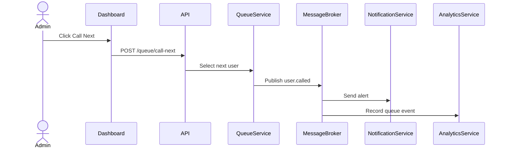
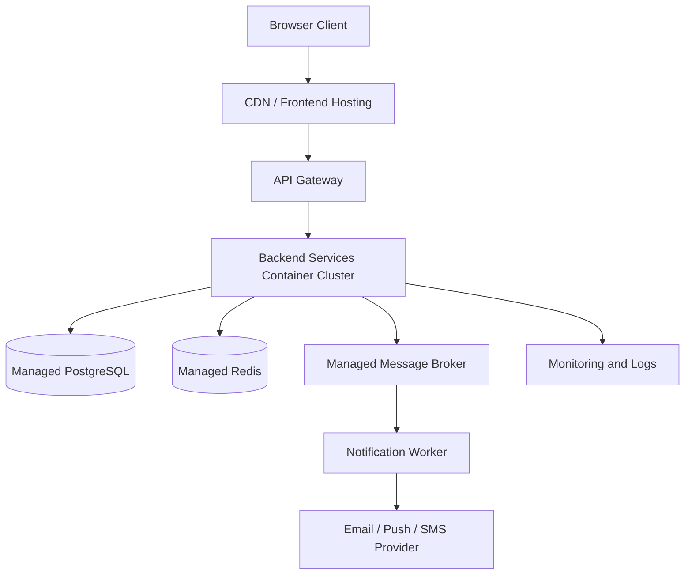

# SmartQueue Cloud – Technical Report

## Intelligent Cloud Platform for Queue and Appointment Management

---

## Table of Contents

1. [Introduction](#1-introduction)
2. [Case Study: International and National Context](#2-case-study-international-and-national-context)
3. [Existing Similar Solutions](#3-existing-similar-solutions)
4. [Proposed Solution](#4-proposed-solution)
5. [Innovation and Originality](#5-innovation-and-originality)
6. [Technologies Used and Motivation](#6-technologies-used-and-motivation)
7. [System Architecture](#7-system-architecture)
8. [Architectural Diagram](#8-architectural-diagram)
9. [Use-Case Diagrams](#9-use-case-diagrams)
10. [Functionality Flows](#10-functionality-flows)
11. [Data Model](#11-data-model)
12. [API Documentation Using OpenAPI](#12-api-documentation-using-openapi)
13. [Marketing Approach](#13-marketing-approach)
14. [Business Model Canvas](#14-business-model-canvas)
15. [Security and Privacy](#15-security-and-privacy)
16. [Deployment Strategy](#16-deployment-strategy)
17. [Limitations](#17-limitations)
18. [Use of AI Tools](#18-use-of-ai-tools)
19. [Conclusion](#19-conclusion)
20. [References](#20-references)

---

## 1. Introduction

**SmartQueue Cloud** is a cloud-based software application designed to manage appointments, virtual queues, waiting times, notifications, and administrative workflows for institutions that interact with many users daily.

The solution targets:

- public institutions;
- universities;
- clinics and hospitals;
- banks;
- private offices;
- customer-service centers.

The project responds to a real problem: physical queues are still common in many service environments, while existing digital appointment systems are often fragmented, institution-specific, or lacking real-time queue intelligence.

SmartQueue Cloud proposes a distributed cloud architecture that combines:

- appointment booking;
- real-time queue monitoring;
- wait-time estimation;
- notifications;
- administrative analytics;
- business-oriented reporting.

The main innovation is the integration of **real-time queue state** with **historical processing data** in order to estimate waiting time and recommend less crowded time slots.

---

## 2. Case Study: International and National Context

### 2.1 International Context

Queue management is a relevant international problem in public administration, healthcare, education, banking, telecom, and retail.

Many organizations have moved from traditional ticket-based systems to virtual queues and appointment-based systems.

Existing international platforms such as **Qmatic**, **QLess**, and **Wavetec** demonstrate that the market needs cloud-based queue management, appointment scheduling, virtual check-in, notifications, and analytics.

Examples of international solutions:

- **Qmatic** – customer journey and queue management platform;
- **QLess** – virtual queue and appointment scheduling solution;
- **Wavetec** – queue management platform with online booking, kiosks, digital signage, and analytics.

This confirms that SmartQueue Cloud is anchored in a real international trend: replacing physical waiting with digital, cloud-based, data-driven service flows.

### 2.2 National Context: Romania

Romania still has significant room for improvement in digital public services.

Although platforms such as **Ghișeul.ro**, **ROeID**, and other digital public services have improved access to certain administrative operations, many services still require physical interaction with public offices.

In Romanian institutions, many processes are partially digitalized, but users may still need to physically visit offices and wait without accurate information about:

- queue length;
- service duration;
- estimated waiting time;
- counter availability;
- peak hours.

This creates a clear opportunity for a solution like SmartQueue Cloud.

The application addresses this gap by combining:

- appointment scheduling;
- virtual waiting;
- live updates;
- proactive notifications;
- administrative dashboards;
- analytics for decision-making.

---

## 3. Existing Similar Solutions

### 3.1 Qmatic

Qmatic is an established queue and customer journey management solution.

Its platform includes:

- queue management;
- appointment booking;
- mobile tickets;
- workload balancing;
- customer flow optimization;
- analytics.

#### Architecture and Technologies

Qmatic appears to follow a cloud customer-experience platform model with web interfaces, booking modules, queue management components, and integration capabilities.

#### Marketing Approach

The product is positioned as an enterprise customer journey platform for organizations that want to reduce waiting time and improve service delivery.

#### Limitations Compared to SmartQueue Cloud

For an academic project, SmartQueue Cloud differentiates itself through:

- transparent modular architecture;
- explainable wait-time estimation;
- focus on Romanian institutional scenarios;
- API-first design;
- open technical documentation.

---

### 3.2 QLess

QLess offers virtual queue and appointment scheduling functionality.

It allows users to:

- join queues remotely;
- check in virtually;
- monitor wait times;
- avoid waiting physically at the service location.

#### Architecture and Technologies

QLess follows a SaaS model with:

- web/mobile access;
- queue state management;
- notifications;
- appointment scheduling;
- real-time updates.

#### Marketing Approach

QLess targets:

- government offices;
- higher education;
- healthcare;
- retail.

Its main value proposition is reducing physical waiting and improving service flow.

#### Limitations Compared to SmartQueue Cloud

QLess is a commercial solution, while SmartQueue Cloud is designed as an educational and demonstrable cloud computing project where:

- architecture is visible;
- APIs are documented;
- data models are transparent;
- deployment decisions can be explained.

---

### 3.3 Wavetec

Wavetec provides queue management systems for walk-ins and appointments.

Its features include:

- online booking;
- self-check-in;
- SMS alerts;
- real-time analytics;
- kiosks;
- digital signage;
- virtual queues.

#### Architecture and Technologies

Wavetec combines cloud software with possible physical components such as:

- kiosks;
- ticket printers;
- digital signage;
- centralized dashboards;
- cloud servers.

#### Marketing Approach

The product is marketed toward organizations that want to:

- reduce wait times;
- improve customer experience;
- manage queues across locations;
- analyze service performance.

#### Limitations Compared to SmartQueue Cloud

Wavetec is broad and hardware-integrated.

SmartQueue Cloud focuses on a software-first, cloud-native architecture that can be demonstrated with:

- containerized services;
- public cloud deployment;
- REST APIs;
- OpenAPI documentation;
- distributed event processing.

---

## 4. Proposed Solution

SmartQueue Cloud is a web-based platform with two main user categories.

### 4.1 Citizen / Customer / Student / Patient

Regular users can:

- create an account;
- authenticate;
- view available services;
- book appointments;
- join a virtual queue;
- check their queue position;
- view estimated waiting time;
- receive notifications;
- cancel or reschedule appointments.

### 4.2 Institution Administrator

Administrators can:

- define institution services;
- configure counters;
- manage working schedules;
- call the next person in queue;
- view queue status in real time;
- access reports and statistics;
- configure notification rules;
- monitor service performance.

### 4.3 Example Use Scenarios

The system can be used by:

- a faculty secretary office;
- a city hall department;
- a hospital or clinic;
- a bank branch;
- a private service center.

---

## 5. Innovation and Originality

The innovation of SmartQueue Cloud is not only the digitization of queues, but the combination of several cloud-driven mechanisms.

### 5.1 Real-Time Queue State

Every appointment, check-in, cancellation, and service completion updates the queue state.

### 5.2 Estimated Waiting Time

The system calculates waiting time based on:

- number of people waiting;
- average service duration;
- number of active counters;
- historical data for the selected service;
- real-time delays.

### 5.3 Cloud-Native Event-Driven Architecture

Queue events are processed asynchronously using a message broker.

Examples of events:

- `appointment.created`;
- `queue.updated`;
- `user.checked_in`;
- `user.called`;
- `service.completed`;
- `notification.required`.

### 5.4 Proactive Notifications

Users are notified before their turn approaches.

### 5.5 Administrative Analytics

Institutions can identify:

- peak hours;
- overloaded counters;
- inefficient service flows;
- average waiting times;
- average processing times.

### 5.6 Optional AI-Assisted Component

The project may include a controlled AI component, such as:

- chatbot for frequently asked questions;
- automatic classification of user requests;
- recommendation of less crowded appointment intervals.

---

## 6. Technologies Used and Motivation

| Layer | Technology | Motivation |
|---|---|---|
| Frontend | React / Next.js | Modern web interface, reusable components, strong ecosystem |
| Backend API | Node.js + NestJS or Python FastAPI | Fast development, REST API support, OpenAPI integration |
| Database | PostgreSQL | Reliable relational database, strong consistency, good for appointments and users |
| Cache / Real-Time State | Redis | Fast queue state, session cache, temporary tokens |
| Message Broker | RabbitMQ / AWS SQS / Kafka | Asynchronous event processing for notifications and queue updates |
| Authentication | JWT + OAuth2-compatible design | Stateless authentication suitable for distributed systems |
| Notifications | Email service / Firebase Cloud Messaging / SMS provider | User reminders and queue updates |
| Containers | Docker | Portable deployment and reproducible environments |
| Orchestration | Docker Compose / Kubernetes | Demonstrates cloud and distributed deployment |
| Monitoring | Prometheus + Grafana | Observability, metrics, performance tracking |
| API Documentation | OpenAPI + SwaggerHub | Standardized API description and interactive documentation |

### 6.1 Why React / Next.js?

React and Next.js are suitable because they allow the development of dynamic web interfaces with reusable components. They are appropriate for dashboards, appointment forms, queue visualization pages, and admin panels.

### 6.2 Why Node.js / NestJS or FastAPI?

Both options are valid for cloud-native backend development.

NestJS is suitable because it provides:

- modular structure;
- dependency injection;
- REST API support;
- Swagger/OpenAPI integration;
- scalability for larger applications.

FastAPI is also suitable because it offers:

- high performance;
- automatic OpenAPI generation;
- simple syntax;
- strong typing with Python.

### 6.3 Why PostgreSQL?

PostgreSQL is appropriate because the application uses relational data:

- users;
- services;
- counters;
- appointments;
- queue entries;
- notifications;
- reports.

### 6.4 Why Redis?

Redis is useful for temporary and fast-changing data, such as:

- current queue state;
- user sessions;
- estimated waiting time cache;
- live dashboard data.

### 6.5 Why Message Broker?

A message broker allows asynchronous communication between services.

For example, when a user checks in:

1. Queue Service updates the queue.
2. A `queue.updated` event is published.
3. Estimation Service recalculates waiting time.
4. Notification Service sends a message if needed.

This improves scalability and decouples services.

---

## 7. System Architecture

### 7.1 Architectural Style

The proposed system uses a **modular cloud-native architecture**.

For the project implementation, the services can be deployed using Docker Compose, while the architecture remains compatible with Kubernetes or cloud platforms.

### 7.2 Main Components

#### Web Client

The web client provides:

- user interface;
- admin dashboard;
- appointment forms;
- queue visualization;
- notifications page.

#### API Gateway

The API Gateway:

- routes requests to backend services;
- handles authentication middleware;
- centralizes API access;
- simplifies communication with the frontend.

#### Authentication Service

The Authentication Service manages:

- registration;
- login;
- JWT issuing;
- role-based access control.

#### Appointment Service

The Appointment Service manages:

- appointment creation;
- appointment update;
- appointment cancellation;
- available time slots;
- appointment validation.

#### Queue Service

The Queue Service manages:

- virtual queues;
- check-in;
- queue positions;
- calling the next user;
- service completion.

#### Wait-Time Estimation Service

The Estimation Service calculates estimated waiting time using:

- current queue length;
- active counters;
- average service duration;
- historical service data;
- recent delays.

#### Notification Service

The Notification Service:

- consumes events from the message broker;
- sends email, push, SMS, or simulated notifications;
- stores notification history.

#### Analytics Service

The Analytics Service generates:

- waiting-time reports;
- peak-hour analysis;
- service-load statistics;
- counter performance metrics.

#### PostgreSQL Database

PostgreSQL stores persistent data:

- users;
- services;
- counters;
- appointments;
- queue entries;
- notifications;
- analytics data.

#### Redis

Redis stores:

- live queue state;
- cache;
- temporary tokens;
- fast-access estimation data.

#### Message Broker

The Message Broker transports events between services.

Examples:

- `appointment.created`;
- `queue.updated`;
- `notification.required`;
- `service.completed`.

---

## 8. Architectural Diagram



---

## 9. Use-Case Diagrams

### 9.1 User Use Cases



### 9.2 Administrator Use Cases



---

## 10. Functionality Flows

### 10.1 Appointment Booking Flow

1. User logs in.
2. User selects institution, department, service, and date.
3. Appointment Service requests available slots.
4. User selects a slot.
5. Appointment is saved in PostgreSQL.
6. `appointment.created` event is published to the message broker.
7. Notification Service sends confirmation.
8. Queue Service prepares the appointment for future check-in.



### 10.2 Check-In and Queue Flow

1. User arrives or checks in remotely.
2. Queue Service validates appointment.
3. User receives a queue number.
4. Queue state is stored in Redis and persisted in PostgreSQL.
5. Queue Service publishes `queue.updated`.
6. Estimation Service recalculates waiting time.
7. User sees updated queue position and estimated waiting time.



### 10.3 Calling the Next User

1. Administrator presses “Call next”.
2. Queue Service selects the next eligible user.
3. Queue status is updated.
4. Notification Service sends an alert.
5. Display/dashboard updates in real time.
6. After service completion, the administrator marks the appointment as completed.
7. Analytics Service records actual service duration.



### 10.4 Wait-Time Estimation Flow

1. Queue state changes.
2. Estimation Service receives event.
3. Service reads:
   - number of waiting users;
   - active counters;
   - average processing time;
   - recent delays;
   - historical service duration.
4. Estimated time is calculated.
5. Result is stored and returned to the frontend.

Example formula:

```text
estimated_wait_time =
    number_of_people_before_user
    × average_service_duration
    / number_of_active_counters
```

A more advanced version may apply a correction factor based on historical delays.

---

## 11. Data Model

### 11.1 User

| Field | Type | Description |
|---|---|---|
| id | UUID | Unique user identifier |
| name | string | Full name |
| email | string | Login email |
| password_hash | string | Encrypted password |
| role | enum | USER / ADMIN |
| created_at | datetime | Account creation date |

### 11.2 Service

| Field | Type | Description |
|---|---|---|
| id | UUID | Service identifier |
| name | string | Service name |
| description | string | Service description |
| average_duration | integer | Average processing time in minutes |
| institution_id | UUID | Related institution |

### 11.3 Counter

| Field | Type | Description |
|---|---|---|
| id | UUID | Counter identifier |
| name | string | Counter name |
| service_id | UUID | Service handled |
| status | enum | OPEN / CLOSED / PAUSED |

### 11.4 Appointment

| Field | Type | Description |
|---|---|---|
| id | UUID | Appointment identifier |
| user_id | UUID | User who booked |
| service_id | UUID | Requested service |
| scheduled_time | datetime | Appointment date and time |
| status | enum | BOOKED / CHECKED_IN / IN_PROGRESS / COMPLETED / CANCELLED |
| created_at | datetime | Creation date |

### 11.5 QueueEntry

| Field | Type | Description |
|---|---|---|
| id | UUID | Queue entry identifier |
| appointment_id | UUID | Related appointment |
| queue_number | integer | User queue number |
| position | integer | Current queue position |
| estimated_wait_time | integer | Estimated wait time in minutes |
| status | enum | WAITING / CALLED / SERVING / DONE / MISSED |

---

## 12. API Documentation Using OpenAPI

The APIs should be documented in **SwaggerHub** using the OpenAPI Specification.

### 12.1 Main API Groups

#### Authentication API

| Method | Endpoint | Description |
|---|---|---|
| POST | `/auth/register` | Register a new user |
| POST | `/auth/login` | Authenticate user |
| GET | `/auth/me` | Get current authenticated user |

#### Services API

| Method | Endpoint | Description |
|---|---|---|
| GET | `/services` | Get available services |
| POST | `/services` | Create service |
| PUT | `/services/{id}` | Update service |
| DELETE | `/services/{id}` | Delete service |

#### Appointments API

| Method | Endpoint | Description |
|---|---|---|
| GET | `/appointments` | Get user appointments |
| POST | `/appointments` | Create appointment |
| GET | `/appointments/{id}` | Get appointment details |
| PATCH | `/appointments/{id}/cancel` | Cancel appointment |

#### Queue API

| Method | Endpoint | Description |
|---|---|---|
| POST | `/queue/check-in` | Check in for an appointment |
| GET | `/queue/{serviceId}` | View queue for a service |
| POST | `/queue/call-next` | Call next user |
| PATCH | `/queue/{entryId}/complete` | Complete service |

#### Estimation API

| Method | Endpoint | Description |
|---|---|---|
| GET | `/estimate/{queueEntryId}` | Get estimated waiting time |

#### Notifications API

| Method | Endpoint | Description |
|---|---|---|
| GET | `/notifications` | Get user notifications |
| PATCH | `/notifications/{id}/read` | Mark notification as read |

#### Analytics API

| Method | Endpoint | Description |
|---|---|---|
| GET | `/analytics/wait-times` | Get wait-time report |
| GET | `/analytics/service-load` | Get service-load report |
| GET | `/analytics/peak-hours` | Get peak-hours report |

### 12.2 OpenAPI Example

```yaml
openapi: 3.0.3
info:
  title: SmartQueue Cloud API
  version: 1.0.0
  description: REST API for appointment booking, virtual queue management, wait-time estimation and notifications.
servers:
  - url: https://api.smartqueue-cloud.example.com/v1
    description: Production server
  - url: http://localhost:8080/v1
    description: Local development server

tags:
  - name: Auth
  - name: Services
  - name: Appointments
  - name: Queue
  - name: Analytics

paths:
  /auth/register:
    post:
      tags:
        - Auth
      summary: Register a new user
      requestBody:
        required: true
        content:
          application/json:
            schema:
              type: object
              required:
                - name
                - email
                - password
              properties:
                name:
                  type: string
                  example: Mihai Chiriac
                email:
                  type: string
                  example: mihai@example.com
                password:
                  type: string
                  format: password
                  example: StrongPassword123
      responses:
        "201":
          description: User registered successfully
        "409":
          description: Email already exists

  /auth/login:
    post:
      tags:
        - Auth
      summary: Authenticate user and return JWT token
      requestBody:
        required: true
        content:
          application/json:
            schema:
              type: object
              required:
                - email
                - password
              properties:
                email:
                  type: string
                  example: mihai@example.com
                password:
                  type: string
                  format: password
      responses:
        "200":
          description: Successful authentication
          content:
            application/json:
              schema:
                type: object
                properties:
                  accessToken:
                    type: string
                  role:
                    type: string
                    enum:
                      - USER
                      - ADMIN
        "401":
          description: Invalid credentials

  /services:
    get:
      tags:
        - Services
      summary: Get available services
      responses:
        "200":
          description: List of services
          content:
            application/json:
              schema:
                type: array
                items:
                  $ref: "#/components/schemas/Service"

  /appointments:
    post:
      tags:
        - Appointments
      summary: Create a new appointment
      security:
        - bearerAuth: []
      requestBody:
        required: true
        content:
          application/json:
            schema:
              type: object
              required:
                - serviceId
                - scheduledTime
              properties:
                serviceId:
                  type: string
                  format: uuid
                scheduledTime:
                  type: string
                  format: date-time
      responses:
        "201":
          description: Appointment created
          content:
            application/json:
              schema:
                $ref: "#/components/schemas/Appointment"
        "400":
          description: Invalid request or unavailable slot

  /queue/check-in:
    post:
      tags:
        - Queue
      summary: Check in for an appointment and join the virtual queue
      security:
        - bearerAuth: []
      requestBody:
        required: true
        content:
          application/json:
            schema:
              type: object
              required:
                - appointmentId
              properties:
                appointmentId:
                  type: string
                  format: uuid
      responses:
        "200":
          description: User checked in successfully
          content:
            application/json:
              schema:
                $ref: "#/components/schemas/QueueEntry"

  /queue/call-next:
    post:
      tags:
        - Queue
      summary: Call the next user in queue
      security:
        - bearerAuth: []
      requestBody:
        required: true
        content:
          application/json:
            schema:
              type: object
              required:
                - serviceId
                - counterId
              properties:
                serviceId:
                  type: string
                  format: uuid
                counterId:
                  type: string
                  format: uuid
      responses:
        "200":
          description: Next user called
          content:
            application/json:
              schema:
                $ref: "#/components/schemas/QueueEntry"

  /estimate/{queueEntryId}:
    get:
      tags:
        - Queue
      summary: Get estimated waiting time for a queue entry
      security:
        - bearerAuth: []
      parameters:
        - name: queueEntryId
          in: path
          required: true
          schema:
            type: string
            format: uuid
      responses:
        "200":
          description: Estimated waiting time
          content:
            application/json:
              schema:
                type: object
                properties:
                  queueEntryId:
                    type: string
                    format: uuid
                  estimatedWaitTime:
                    type: integer
                    example: 18
                  unit:
                    type: string
                    example: minutes

components:
  securitySchemes:
    bearerAuth:
      type: http
      scheme: bearer
      bearerFormat: JWT

  schemas:
    Service:
      type: object
      properties:
        id:
          type: string
          format: uuid
        name:
          type: string
        description:
          type: string
        averageDuration:
          type: integer
          example: 10

    Appointment:
      type: object
      properties:
        id:
          type: string
          format: uuid
        userId:
          type: string
          format: uuid
        serviceId:
          type: string
          format: uuid
        scheduledTime:
          type: string
          format: date-time
        status:
          type: string
          enum:
            - BOOKED
            - CHECKED_IN
            - IN_PROGRESS
            - COMPLETED
            - CANCELLED

    QueueEntry:
      type: object
      properties:
        id:
          type: string
          format: uuid
        appointmentId:
          type: string
          format: uuid
        queueNumber:
          type: integer
        position:
          type: integer
        estimatedWaitTime:
          type: integer
        status:
          type: string
          enum:
            - WAITING
            - CALLED
            - SERVING
            - DONE
            - MISSED
```

---

## 13. Marketing Approach

SmartQueue Cloud can be marketed as a **B2B SaaS platform** for institutions that need to improve visitor flow and reduce waiting time.

### 13.1 Target Customers

- universities;
- city halls;
- hospitals and clinics;
- banks;
- telecom stores;
- public agencies;
- private service offices.

### 13.2 Value Proposition

SmartQueue Cloud helps institutions:

- reduce waiting time;
- avoid overcrowding;
- improve user satisfaction;
- obtain operational analytics;
- increase transparency;
- optimize staff workload.

### 13.3 Differentiation

Compared to generic appointment tools, SmartQueue Cloud provides:

- live queue position;
- estimated waiting time;
- real-time notifications;
- admin dashboard;
- analytics;
- cloud deployment;
- modular APIs;
- support for multiple institutions and services.

### 13.4 Pricing Model

| Plan | Target | Features |
|---|---|---|
| Free / Demo | Small teams, academic demo | 1 institution, limited users |
| Basic | Small offices | Appointment booking, queue dashboard |
| Professional | Clinics, universities | Notifications, analytics, multiple services |
| Enterprise | Large institutions | Multi-location support, advanced reporting, integrations |

---

## 14. Business Model Canvas

| Block | Description |
|---|---|
| Customer Segments | Public institutions, universities, clinics, banks, private offices, service centers |
| Value Proposition | Reduced waiting time, virtual queues, appointment scheduling, real-time updates, analytics |
| Channels | Website, direct B2B sales, institutional partnerships, cloud marketplace |
| Customer Relationships | Self-service onboarding, technical support, admin dashboard, documentation |
| Revenue Streams | Monthly SaaS subscription, enterprise licensing, premium analytics, integration fees |
| Key Resources | Cloud infrastructure, development team, queue estimation algorithm, database, API platform |
| Key Activities | Software development, cloud deployment, monitoring, customer support, analytics improvement |
| Key Partners | Cloud providers, SMS/email providers, public institutions, universities |
| Cost Structure | Cloud hosting, database hosting, development, maintenance, monitoring, support, notification costs |

---

## 15. Security and Privacy

The system handles personal data such as names, emails, appointments, and service history.

Therefore, the following measures are required:

- password hashing;
- JWT-based authentication;
- role-based access control;
- HTTPS communication;
- database access restrictions;
- input validation;
- audit logs for administrative actions;
- minimal storage of personal information;
- clear data retention policy;
- GDPR-aware design for European deployment.

---

## 16. Deployment Strategy

### 16.1 Development Deployment

For the academic implementation, the following services can run locally using Docker Compose:

```text
React Frontend
Backend API
PostgreSQL
Redis
RabbitMQ
Notification Mock Service
```

### 16.2 Cloud Deployment

A production-like deployment may use:

- frontend on Vercel, Netlify, or AWS S3 + CloudFront;
- backend containers on AWS ECS, Google Cloud Run, Azure Container Apps, or Kubernetes;
- PostgreSQL on Supabase, Neon, AWS RDS, or Google Cloud SQL;
- Redis on Upstash, AWS ElastiCache, or Redis Cloud;
- message broker through RabbitMQ Cloud, AWS SQS, or Google Pub/Sub;
- monitoring through Grafana Cloud or cloud-native tools.

### 16.3 Example Deployment Diagram



---

## 17. Limitations

The first version of SmartQueue Cloud has several limitations:

- wait-time estimation may be inaccurate if historical data is limited;
- SMS notifications may require paid third-party providers;
- kiosk and digital signage support may be simulated rather than physically implemented;
- high-availability deployment may be simplified for the academic prototype;
- AI features may be limited to controlled, documented use cases;
- integration with real public institutions is outside the initial prototype scope.

---

## 18. Use of AI Tools

AI tools may be used during the development process for:

- generating documentation drafts;
- creating initial API descriptions;
- suggesting architecture alternatives;
- generating test data;
- explaining errors;
- improving UI text.

AI usage must be controlled and documented.

The team remains responsible for:

- understanding all generated content;
- validating all generated code;
- adapting suggestions to the actual implementation;
- explaining technical decisions during the presentation.

AI must not replace the team’s understanding of the system.

---

## 19. Conclusion

SmartQueue Cloud is a realistic and relevant cloud computing project.

It addresses a practical problem found both internationally and nationally: inefficient queue and appointment management.

The solution is:

- cloud-native;
- modular;
- API-driven;
- distributed;
- suitable for containerized deployment;
- suitable for public cloud deployment.

The project demonstrates important cloud computing concepts:

- distributed services;
- REST APIs;
- OpenAPI documentation;
- cloud databases;
- message queues;
- caching;
- asynchronous processing;
- monitoring;
- containerized deployment;
- scalable architecture.

Its innovation consists in combining virtual queue management with:

- real-time wait-time estimation;
- proactive notifications;
- analytics for institutional decision-making;
- transparent API documentation;
- cloud-oriented deployment.

---

## 20. References

1. Qmatic – Customer journey and queue management solutions: <https://www.qmatic.com/>
2. QLess – Virtual queue and appointment scheduling: <https://www.qless.com/>
3. Wavetec – Queue management system: <https://www.wavetec.com/solutions/queue-management-system/>
4. OpenAPI Specification 3.0.3: <https://spec.openapis.org/oas/v3.0.3.html>
5. SwaggerHub and Swagger tools: <https://swagger.io/tools/>
6. European Commission – Romania Digital Decade country report: <https://digital-strategy.ec.europa.eu/>
7. Ghișeul.ro – Romanian electronic payment platform: <https://www.ghiseul.ro/>
8. ROeID – Romanian electronic identity platform: <https://www.roeid.ro/>

---

## Suggested GitHub Repository Structure

```text
smartqueue-cloud/
├── README.md
├── docs/
│   ├── technical-report.md
│   ├── openapi.yaml
│   ├── architecture.md
│   └── diagrams.md
├── backend/
│   ├── src/
│   ├── Dockerfile
│   └── package.json
├── frontend/
│   ├── src/
│   ├── Dockerfile
│   └── package.json
├── docker-compose.yml
└── .github/
    └── workflows/
        └── ci.yml
```

---

## Suggested README Short Description

```text
SmartQueue Cloud is a cloud-native platform for appointment scheduling, virtual queue management, real-time waiting time estimation, notifications, and administrative analytics.
```
