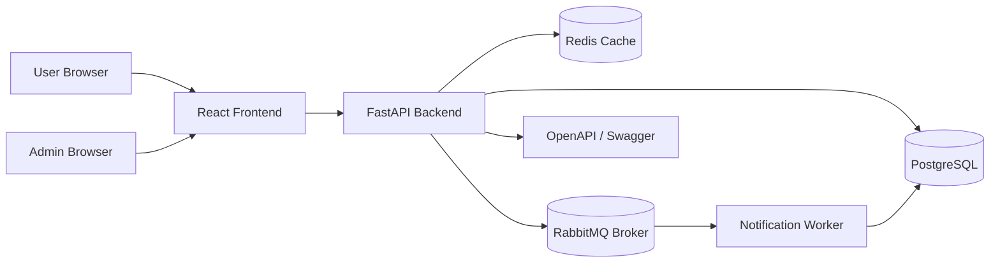

# SmartQueue Cloud – Distributed MVP

SmartQueue Cloud is a cloud-oriented platform for appointment scheduling, virtual queue management, waiting-time estimation, event-driven notifications and administrative analytics.

This version extends the MVP with:

- PostgreSQL database
- Redis cache for queue snapshots
- RabbitMQ event broker
- Separate notification worker container
- JWT authentication
- User and admin roles
- OpenAPI / Swagger documentation
- Deployment documentation for Vercel, Render and Railway

## Architecture



## Main Features

- Register/login using JWT
- User/admin role separation
- Appointment creation
- Virtual queue check-in
- Queue position and ETA calculation
- Redis cache for queue snapshots
- RabbitMQ events:
  - `appointment.created`
  - `queue.checked_in`
  - `queue.user_called`
  - `queue.service_completed`
- Separate notification worker
- Simulated notifications stored in PostgreSQL
- Analytics endpoints and UI
- Swagger/OpenAPI at `/docs`

## Run with Docker Compose

```bash
docker compose up --build
```

Then open:

```text
Frontend:  http://localhost:5173
Backend:   http://localhost:8000
Swagger:   http://localhost:8000/docs
OpenAPI:   http://localhost:8000/openapi.json
RabbitMQ:  http://localhost:15672
```

RabbitMQ dashboard:

```text
username: guest
password: guest
```

## Demo Accounts

```text
Admin:
admin@demo.com
admin123

User:
user@demo.com
user123
```

## Demo Flow

1. Login as user.
2. Create an appointment.
3. Check in.
4. View queue and estimated waiting time.
5. View notifications generated by the worker.
6. Login as admin.
7. Call next user.
8. Complete service.
9. Check analytics.
10. Open Swagger documentation.

## Cloud Deployment

See:

- `docs/DEPLOYMENT.md`
- `docs/SWAGGERHUB.md`
- `docs/DISTRIBUTED_ARCHITECTURE.md`
