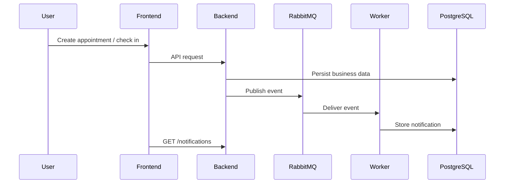

# Distributed Architecture

This version extends the MVP with Redis, RabbitMQ and a separate notification worker.

## Components

| Component | Role |
|---|---|
| React Frontend | User and administrator interface |
| FastAPI Backend | REST API, authentication, appointment and queue logic |
| PostgreSQL | Persistent storage |
| Redis | Queue snapshot cache |
| RabbitMQ | Event broker |
| Notification Worker | Consumes events and creates notifications |

## Event Flow



## Redis Usage

The queue endpoint first checks Redis for a cached snapshot:

```text
GET /queue/{service_id}
```

If Redis contains a snapshot, the backend returns it. If not, the backend reads PostgreSQL, serializes the queue and stores it in Redis for 120 seconds.

Whenever the queue changes, the backend invalidates the Redis key.

## RabbitMQ Events

The backend publishes these events:

- `appointment.created`
- `queue.checked_in`
- `queue.user_called`
- `queue.service_completed`

The notification worker consumes these events and creates notifications.
