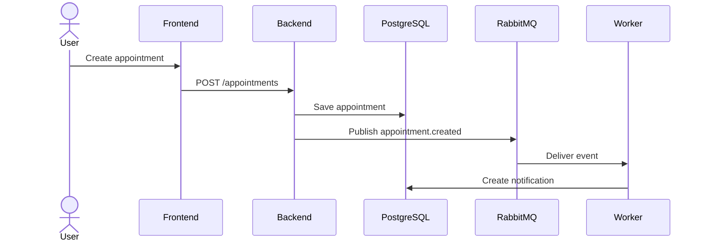
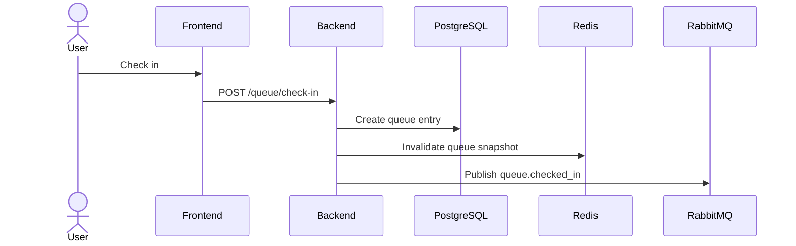
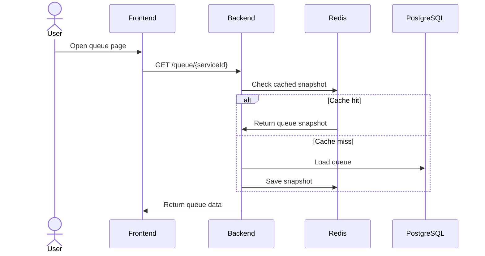

# Functionality Flows

## Appointment Created Event

```mermaid
sequenceDiagram
    actor User
    participant Frontend
    participant Backend
    participant PostgreSQL
    participant RabbitMQ
    participant Worker

    User->>Frontend: Create appointment
    Frontend->>Backend: POST /appointments
    Backend->>PostgreSQL: Save appointment
    Backend->>RabbitMQ: Publish appointment.created
    RabbitMQ->>Worker: Deliver event
    Worker->>PostgreSQL: Create notification
```

## Check-In and Queue Cache

```mermaid
sequenceDiagram
    actor User
    participant Frontend
    participant Backend
    participant PostgreSQL
    participant Redis
    participant RabbitMQ

    User->>Frontend: Check in
    Frontend->>Backend: POST /queue/check-in
    Backend->>PostgreSQL: Create queue entry
    Backend->>Redis: Invalidate queue snapshot
    Backend->>RabbitMQ: Publish queue.checked_in
```

## Queue Read with Redis

```mermaid
sequenceDiagram
    actor User
    participant Frontend
    participant Backend
    participant Redis
    participant PostgreSQL

    User->>Frontend: Open queue page
    Frontend->>Backend: GET /queue/{serviceId}
    Backend->>Redis: Check cached snapshot
    alt Cache hit
        Redis->>Backend: Return queue snapshot
    else Cache miss
        Backend->>PostgreSQL: Load queue
        Backend->>Redis: Save snapshot
    end
    Backend->>Frontend: Return queue data
```
